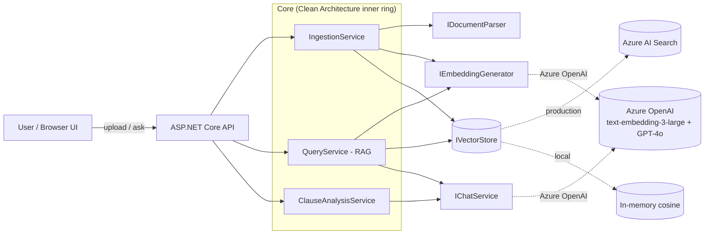

# Contract Intelligence Platform

> Upload contracts → AI extracts and risk-scores clauses, flags GDPR exposure, and answers
> natural-language questions **with citations**. Built on **.NET 10**, **Semantic Kernel**,
> **Azure OpenAI** and **Azure AI Search**, using Clean Architecture and Retrieval-Augmented
> Generation (RAG).

<p align="center">
  
  
  
  
  
  <a href="https://github.com/JobsDart/contract-intelligence-platform/actions"></a>
</p>

> **▶ Live demo:** https://contract-intelligence.happywave-99507ff3.swedencentral.azurecontainerapps.io — upload a contract (or `samples/sample-services-agreement.txt`) and ask a question. First load may take ~20s while it scales from zero.

---

## What problem does it solve?

Legal, procurement and compliance teams spend hours reading contracts to answer questions like
*"What are the termination clauses?"* or *"Does this expose us under GDPR?"*. This platform turns
a folder of contracts into a searchable, question-answering knowledge base where **every answer is
grounded in a citable passage** — page number and source file included — so nothing is hallucinated.

| Capability | Description |
|------------|-------------|
| 📥 **Ingestion** | Upload PDF / TXT / Markdown. Text is extracted, chunked and embedded. |
| 🔎 **Grounded Q&A (RAG)** | Ask in plain English; get an answer with `[n]` citations to source passages. |
| 🏷️ **Clause extraction** | The LLM identifies clauses (Payment, Termination, GDPR, Liability …). |
| ⚠️ **Risk scoring** | Every clause is rated Low / Medium / High with a rationale. |
| 🏢 **Multi-tenant** | Every query is tenant-scoped — one customer can never see another's data. |
| 🔌 **Swappable backends** | In-memory for instant local demos; Azure AI Search for production. |

---

## Architecture at a glance



The interfaces (`IVectorStore`, `IChatService`, …) live in **Core** and are implemented in
**Infrastructure**, so the business logic has zero knowledge of Azure or any library.
See [docs/ARCHITECTURE.md](docs/ARCHITECTURE.md) for the full breakdown and the RAG sequence diagram.

---

## Technology used

| Layer | Technology | Why |
|-------|-----------|-----|
| Language / runtime | **C# / .NET 10** | Enterprise-grade, the team's core stack |
| AI orchestration | **Semantic Kernel 1.77** | Microsoft's production AI SDK for .NET |
| LLM | **Azure OpenAI — GPT-4o** | Reasoning + clause extraction |
| Embeddings | **Azure OpenAI — text-embedding-3-large** | 3072-dim vectors for retrieval |
| Vector store | **Azure AI Search** (HNSW) / in-memory | Hybrid-ready, tenant-filtered retrieval |
| PDF parsing | **PdfPig** (MIT) | Pure-.NET, reading-order text extraction |
| API | **ASP.NET Core Minimal APIs + OpenAPI** | Lightweight, documented endpoints |
| UI | **Vanilla HTML/JS** (`wwwroot`) | Zero build step — clickable demo |
| Architecture | **Clean Architecture + DDD** | Testable, swappable, explainable |

---

## Repository structure

```
contract-intelligence-platform/
├── src/
│   ├── ContractIntelligence.Core/            # Domain + abstractions + use-case services (no deps)
│   │   ├── Domain/                            # Contract, Clause, DocumentChunk, Citation, …
│   │   ├── Abstractions/                      # IVectorStore, IChatService, IEmbeddingGenerator, …
│   │   └── Application/                       # IngestionService, QueryService, ClauseAnalysisService
│   ├── ContractIntelligence.Infrastructure/  # Implementations (Semantic Kernel, PdfPig, Azure)
│   │   ├── Ai/                                # SK chat + embedding adapters
│   │   ├── Parsing/                           # PDF + plain-text parsers
│   │   ├── Vector/                            # InMemory + Azure AI Search stores
│   │   ├── Storage/                           # Contract metadata store
│   │   └── DependencyInjection.cs            # Composition root (config-driven)
│   └── ContractIntelligence.Api/             # ASP.NET Core host + browser UI
│       ├── Endpoints/                         # Contract + Query minimal-API endpoints
│       └── wwwroot/                           # Single-page UI (index.html)
├── docs/                                      # Architecture, deployment, debugging, ADRs
├── scripts/                                   # Azure provisioning (provision-azure.ps1)
├── samples/                                   # Sample contract for an instant demo
├── Dockerfile                                 # Container image for the API (AKS-ready)
└── ContractIntelligence.sln
```

---

## Quick start

### Prerequisites
- [.NET 10 SDK](https://dotnet.microsoft.com/download)
- An **Azure OpenAI** resource with `gpt-4o` and `text-embedding-3-large` deployments
  (don't have one? run [`scripts/provision-azure.ps1`](scripts/provision-azure.ps1) — see
  [docs/DEPLOYMENT.md](docs/DEPLOYMENT.md)).

### 1. Configure credentials (kept out of source control)
```powershell
cd src/ContractIntelligence.Api
dotnet user-secrets set "Ai:AzureOpenAI:Endpoint" "https://<your-resource>.openai.azure.com/"
dotnet user-secrets set "Ai:AzureOpenAI:ApiKey"   "<your-key>"
```
> The default vector store is **in-memory**, so no database or Azure AI Search is needed to run locally.

### 2. Run
```powershell
dotnet run --project src/ContractIntelligence.Api
```
Open **http://localhost:5080** — upload [`samples/sample-services-agreement.txt`](samples/sample-services-agreement.txt),
then ask *"What are the termination and GDPR clauses, and what is the payment schedule?"*

### 3. (Optional) Use Azure AI Search instead of in-memory
Set `VectorStore:Provider` to `AzureAiSearch` and provide its endpoint/key — see
[Configuration](#configuration). The index is created automatically on first upload.

---

## Configuration

All settings live in `appsettings.json` and can be overridden by user-secrets or environment
variables (use `__` as the separator, e.g. `Ai__AzureOpenAI__ApiKey`).

| Key | Default | Description |
|-----|---------|-------------|
| `Ai:AzureOpenAI:Endpoint` | — | Azure OpenAI endpoint URL |
| `Ai:AzureOpenAI:ApiKey` | — | Azure OpenAI key |
| `Ai:AzureOpenAI:ChatDeployment` | `gpt-4o` | Chat deployment name |
| `Ai:AzureOpenAI:EmbeddingDeployment` | `text-embedding-3-large` | Embedding deployment name |
| `VectorStore:Provider` | `InMemory` | `InMemory` or `AzureAiSearch` |
| `VectorStore:AzureAiSearch:Endpoint` | — | AI Search endpoint (if used) |
| `VectorStore:AzureAiSearch:ApiKey` | — | AI Search admin key (if used) |
| `VectorStore:AzureAiSearch:IndexName` | `contracts` | Index name |
| `VectorStore:AzureAiSearch:Dimensions` | `3072` | Must match the embedding model |

---

## API reference

| Method | Route | Purpose |
|--------|-------|---------|
| `POST` | `/api/contracts` | Upload + analyse a contract (multipart `file`) |
| `GET`  | `/api/contracts` | List this tenant's contracts |
| `GET`  | `/api/contracts/{id}` | Get a contract incl. extracted clauses |
| `POST` | `/api/query` | Ask a question → grounded answer + citations |
| `GET`  | `/openapi/v1.json` | OpenAPI document |

Tenancy is selected via the optional `X-Tenant-Id` header (defaults to `demo-tenant`).

```bash
curl -X POST http://localhost:5080/api/query \
  -H "Content-Type: application/json" \
  -d '{ "question": "What are the termination clauses?", "topK": 5 }'
```

---

## Documentation

- [Architecture](docs/ARCHITECTURE.md) — layers, data flow, design decisions, RAG sequence
- [Deployment](docs/DEPLOYMENT.md) — provision Azure, run in Docker, deploy to Azure
- [Debugging](docs/DEBUGGING.md) — common errors and how to diagnose them
- [ADRs](docs/adr/) — Architecture Decision Records

---

## Roadmap

- [ ] Contract-to-contract comparison (diff clauses across two documents)
- [ ] DOCX parsing (DocumentFormat.OpenXml)
- [ ] EF Core + Azure SQL for durable contract metadata
- [ ] Azure AD (Entra ID) auth → tenant from JWT claim
- [ ] Streaming answers (Server-Sent Events)

---

## License & attribution

Licensed under the [MIT License](LICENSE) © JobsDart.
Architecture inspired by Microsoft's MIT-licensed
[azure-search-openai-demo](https://github.com/Azure-Samples/azure-search-openai-demo);
all code in this repository is original and written for the .NET / Semantic Kernel stack.
