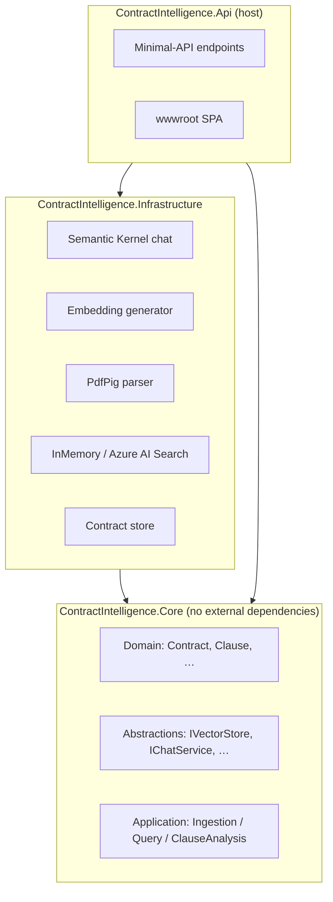
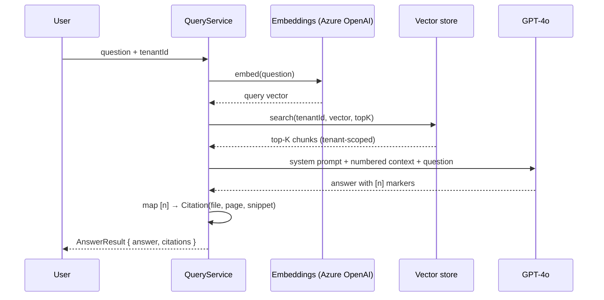

# Architecture

This document explains how the Contract Intelligence Platform is structured, how data flows
through it, and the reasoning behind the key decisions. It is written so a reviewer (or you, in an
interview) can understand the system end to end in ten minutes.

## 1. Guiding principle — Clean Architecture

The solution is split into three projects arranged as concentric rings. Dependencies point
**inward only**: outer rings know about inner rings, never the reverse.



| Project | Responsibility | Depends on |
|---------|----------------|-----------|
| **Core** | Domain model, use-case services, and the **interfaces** the outer layers implement. Pure C#, no NuGet packages. | nothing |
| **Infrastructure** | Concrete implementations: Semantic Kernel, Azure OpenAI, PdfPig, vector stores. | Core |
| **Api** | HTTP host, endpoints, the browser UI, OpenAPI. | Infrastructure, Core |

**Why this matters:** business logic in `Core` is unit-testable with fakes — no Azure account, no
network. You can replace Azure AI Search with Qdrant, or GPT-4o with a local model, by adding one
class in Infrastructure and changing one config value. Nothing in `Core` changes.

## 2. The two pipelines

### 2.1 Ingestion (`IngestionService`)
```
upload → parse (per page) → chunk (1000 chars, 150 overlap) → embed → upsert to vector store
       → extract + risk-score clauses (LLM) → persist contract metadata
```
Indexing and clause analysis are independent: if clause extraction fails, the document is still
searchable (the contract is marked `Indexed`, the error is recorded, and processing continues).

### 2.2 Retrieval-Augmented Generation (`QueryService`)

The model is instructed to answer **only** from the supplied context and to cite passages with
`[n]`. The service then maps those markers back to real `Citation` objects. If the model cites
nothing, all retrieved passages are returned as citations.

## 3. Multi-tenancy

`TenantId` is a first-class field on every `Contract` and every `DocumentChunk`. **Both** vector
stores filter by tenant inside `SearchAsync`, and the metadata store partitions by tenant. The
tenant is currently resolved from the `X-Tenant-Id` header (`TenantResolver`); swapping that for a
JWT claim is a one-method change because the rest of the stack is already tenant-aware.

## 4. Key design decisions (ADRs)

These are recorded in full under [`adr/`](adr/):

1. [ADR-0001](adr/0001-clean-architecture.md) — Clean Architecture with a dependency-free Core
2. [ADR-0002](adr/0002-semantic-kernel.md) — Semantic Kernel as the AI orchestration layer
3. [ADR-0003](adr/0003-dual-mode-vector-store.md) — Swappable in-memory / Azure AI Search vector store

## 5. Extension points

| You want to… | Add / change |
|--------------|--------------|
| Support DOCX | A new `IDocumentParser` in Infrastructure |
| Use Qdrant / pgvector | A new `IVectorStore` implementation |
| Use a local LLM | A new `IChatService` + `IEmbeddingGenerator` |
| Persist contracts durably | An EF Core `IContractStore` |
| Add auth | Change `TenantResolver` to read the JWT principal |
